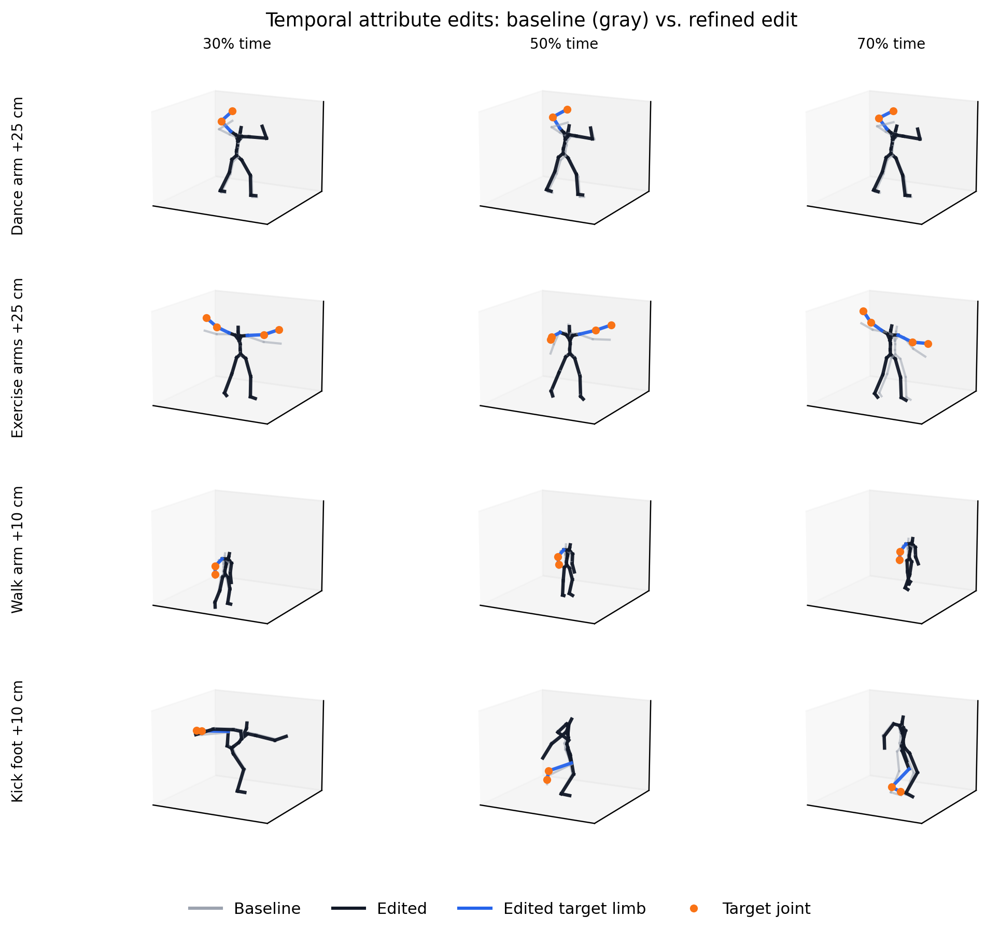
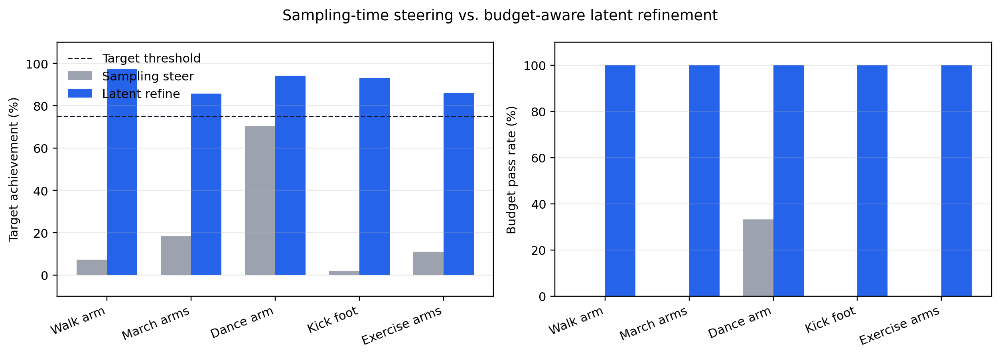
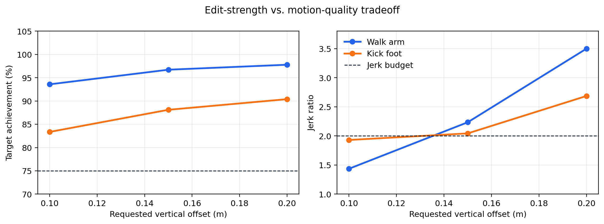

# FlowSteer-Motion: Budget-Aware Inference-Time Temporal Editing for Text-to-Motion Generation

## Abstract

Text-to-motion generation has made rapid progress in producing realistic motions from natural-language prompts, but fine-grained controllability remains difficult to obtain without retraining or adding task-specific control modules. In many practical editing scenarios, a user does not want to regenerate an entirely new motion; instead, they want to modify a local temporal attribute of an already plausible motion, such as raising an arm during the middle of a dance or increasing the height of a kick, while preserving the original motion style and avoiding visible artifacts.

We present **FlowSteer-Motion**, an inference-time editing framework for a pretrained flow-matching text-to-motion model. Our initial sampling-time steering formulation injects differentiable constraint gradients into the Euler flow trajectory through a forward-kinematics decoder, but we find that such updates are often too weak to yield visible temporal edits under realistic quality budgets. To address this limitation, we introduce a **budget-aware latent refinement** stage that optimizes the generated motion latent after sampling while keeping the pretrained generator frozen. The refinement objective combines temporal joint-offset constraints with latent proximity, temporal smoothness, joint-space proximity, and jerk regularization. A latent trust mask and temporal edit window further restrict the optimization to pose-relevant dimensions and user-specified frames.

Experiments on five temporal editing tasks show that latent refinement achieves stable target-directed edits across seven seeds, with 84.7--95.0% target achievement and 85.7--100% budget pass rate under a jerk-ratio threshold of 2.0. In contrast, sampling-time steering often preserves smoothness by making updates that are too weak to be visually useful, reaching only 2.1--70.4% achievement depending on the task. Ablations show that the latent trust mask and temporal edit mask are critical: removing them reduces budget pass rate from 100% to 40.0% and 33.3%, respectively. Compared with target-only latent optimization, our full method improves achievement from 15.7% to 91.3% while reducing outside-window drift from 0.131 m to 0.024 m. These results support inference-time temporal motion editing as a practical alternative to retraining-based controllable generation.

## 1. Introduction

Text-to-motion (T2M) generation aims to synthesize realistic human motion from natural-language descriptions. Recent diffusion and flow-matching models have substantially improved motion naturalness, temporal coherence, and text alignment. However, high-quality generation is not the same as high controllability. In production animation, game prototyping, virtual humans, and embodied-agent simulation, users often need to edit an existing generated motion rather than sample a new one from scratch. Typical requests include raising a hand during a specific temporal interval, increasing the height of a kick, or adjusting the amplitude of an exercise motion while keeping the original action identity intact.

Most controllable motion-generation systems address such requirements at training time. They add new control inputs, train specialized branches, or design separate systems for pose keyframes, trajectories, contacts, and scene constraints. This paradigm can be effective, but it is expensive to extend: every new control type may require new data, architecture changes, or retraining. It also leaves a gap for post-generation editing, where the user already has a plausible motion and wants a local, measurable modification.

This paper studies a different question: **Can a frozen text-to-motion generator be edited at inference time using differentiable motion constraints?** We build on HY-Motion 1.0, a flow-matching T2M model whose motion latent can be decoded into 3D joint positions. This gives us an analytical path from latent variables to motion-space constraints through a differentiable forward-kinematics (FK) decoder. The natural first attempt is to inject constraint gradients during the sampling trajectory, analogous to classifier or reward guidance. However, our experiments show that this is not sufficient for the temporal attribute edits we care about. Sampling-time updates tend to be either too weak to create visible edits or too disruptive when their strength is increased.

We therefore upgrade the method from pure sampling-time steering to **budget-aware latent refinement**. Given a generated baseline latent, we optimize a small latent correction after sampling. The objective explicitly balances edit achievement against motion-quality costs. A temporal joint-offset constraint pulls selected joints toward a user-specified displacement within a time window, while regularizers penalize large latent changes, temporally rough latent deltas, joint-space drift, and jerk. The result is an editor that can express visible changes and expose the cost of stronger edits through quantitative metrics.

This reframing is important. A one-frame pose change is not always useful in human motion editing; practical edits are often temporal attributes over a segment. A method should therefore demonstrate not only that it can reduce a geometric error, but also that it can produce a visible, controllable, and quality-bounded change. Our evaluation is built around this requirement.

Our contributions are:

1. We formulate inference-time temporal attribute editing for flow-matching text-to-motion generation, using differentiable FK constraints without retraining the backbone.
2. We introduce budget-aware latent refinement, combining temporal joint-offset constraints with latent trust masking and smoothness/jerk regularization.
3. We provide an evaluation protocol that reports target achievement, jerk ratio, foot-sliding ratio, locality leakage, root drift, and budget pass rate, making edit controllability and preservation cost explicit.
4. We show that latent refinement substantially outperforms sampling-time steering for visible temporal edits, while revealing an action-dependent edit-strength/quality tradeoff.

## 2. Related Work

### Text-to-Motion Generation

Text-to-motion generation has evolved from sequence-to-sequence and VAE-based models to diffusion and flow-matching generators. Modern systems can produce diverse and realistic human motions conditioned on language prompts. Standard evaluation focuses on distributional quality and text alignment, using metrics such as FID, R-Precision, diversity, and multimodality. These metrics are valuable for unconditional or prompt-conditioned generation, but they do not directly answer whether a user-specified local edit has been achieved.

### Controllable Motion Generation and Editing

Controllable motion-generation methods add constraints such as key poses, trajectories, object interactions, foot contacts, or scene geometry. Many of these methods rely on task-specific conditioning or retraining, which limits extensibility. Motion editing methods instead modify an existing motion, but they often depend on specialized architectures, optimization over non-generative representations, or task-specific assumptions. Our work targets a complementary setting: editing the latent of a frozen T2M model using differentiable constraints and explicit quality budgets.

### Inference-Time Guidance

Inference-time guidance has been widely used in image diffusion models and increasingly explored for other generative domains. The core idea is to steer a pretrained generator using gradients from a reward, classifier, energy, or differentiable constraint. For flow-matching models, the sampling trajectory is an ODE discretization, making it possible to inject gradient-based corrections at each step. We investigate this idea for T2M and find that direct sampling-time steering is useful as a weak guidance mechanism but insufficient for visible temporal motion edits under quality constraints. This motivates our post-sampling latent refinement.

### Motion Quality Metrics

Human motion editing must preserve physical and perceptual quality. We therefore report jerk ratio as a proxy for temporal smoothness and foot-sliding ratio as a proxy for lower-body contact stability. Unlike distribution-level metrics, these quantities directly reveal whether an edit introduces local artifacts. We use them not as secondary decoration but as budget constraints: an edit is considered successful only if it reaches the target while staying within a predefined smoothness budget.

## 3. Method

### 3.1 Preliminaries

We build on a pretrained flow-matching text-to-motion model. Let \(x_t \in \mathbb{R}^{T \times D}\) denote the motion latent at flow time \(t\), where \(T\) is the number of frames and \(D=201\) in HY-Motion's representation. The model learns a velocity field \(v_\theta(x_t, c, t)\) conditioned on text \(c\). Sampling follows an Euler discretization of the probability-flow ODE:

\[
\frac{dx_t}{dt} = v_\theta(x_t, c, t).
\]

The latent representation includes global translation, root rotation, body joint rotations, and auxiliary features. A differentiable FK decoder

\[
\mathcal{D}: \mathbb{R}^{T \times D} \rightarrow \mathbb{R}^{T \times J \times 3}
\]

maps a motion latent to 3D joint positions, where \(J=22\). This decoder provides the differentiable path needed to impose motion-space constraints on latent variables.

### 3.2 Sampling-Time Constraint Steering

Given a differentiable constraint loss \(\mathcal{L}_c\) over decoded joints, a direct inference-time strategy is to modify the Euler sampling update. At each step, we compute a one-step clean estimate

\[
\hat{x}_1 = x_t + (1-t)v_\theta(x_t, c, t),
\]

decode it into joints, and compute a constraint gradient

\[
g_t = \nabla_{x_t}\mathcal{L}_c(\mathcal{D}(\hat{x}_1)).
\]

The Euler update is then augmented with a normalized steering direction:

\[
x_{t+\Delta t} = x_t + \Delta t \left(v_\theta(x_t,c,t) + \alpha(t)s_t\right).
\]

We found three stabilization details necessary for this formulation:

**Per-frame gradient normalization.** Sparse temporal constraints create gradients only near the edited frames. Normalizing over the entire \(T \times D\) tensor dilutes the active frames. We normalize per frame and apply a soft norm so that frames with negligible gradients are automatically attenuated.

**Latent trust mask.** Pose edits should primarily affect joint-rotation dimensions rather than global translation or root orientation. We apply a dimension-wise mask \(m\) before normalization:

\[
\tilde{g}_t = m \odot g_t,
\]

with smaller weights for translation and root-rotation dimensions.

**Temporal windowing.** User edits are temporally localized. We apply a temporal mask around the target window so that gradient updates are concentrated where the edit is requested.

Although these components make sampling-time steering more stable, the approach remains weak for temporal attribute editing. Increasing steering strength can degrade motion, while conservative settings often fail to produce a visible target-directed change. We therefore use sampling-time steering as a baseline and introduce a stronger post-sampling refinement stage.

### 3.3 Budget-Aware Latent Refinement

Let \(z_0\) be the normalized latent of a generated baseline motion. We optimize a refined latent \(z\) after sampling while keeping the pretrained generator and decoder fixed. The objective is

\[
\min_z
\lambda_c \mathcal{L}_c(\mathcal{D}(z))
+ \lambda_z \|z-z_0\|^2
+ \lambda_\Delta \|\nabla_t(z-z_0)\|^2
+ \lambda_j \|\mathcal{D}(z)-\mathcal{D}(z_0)\|^2
+ \lambda_s \|\nabla_t^3 \mathcal{D}(z)\|^2 .
\]

The terms serve different roles:

- \(\mathcal{L}_c\) enforces the user edit.
- \(\|z-z_0\|^2\) limits global latent drift.
- \(\|\nabla_t(z-z_0)\|^2\) discourages temporally abrupt latent corrections.
- \(\|\mathcal{D}(z)-\mathcal{D}(z_0)\|^2\) preserves the baseline motion outside the edited degrees of freedom.
- \(\|\nabla_t^3 \mathcal{D}(z)\|^2\) penalizes jerk and improves visual smoothness.

The same latent trust mask and temporal edit mask are used during refinement, so the optimizer focuses on pose-relevant dimensions and the requested temporal interval.

### 3.4 Temporal Attribute Constraints

A temporal attribute edit is specified by a joint group \(G\), an offset vector \(\delta \in \mathbb{R}^3\), and a normalized temporal window \([a,b]\). For example, "raise the right arm by 25 cm from 30% to 70% of the motion" uses an upward offset for right-arm joints within the middle segment.

Let \(Y_0=\mathcal{D}(z_0)\) be the decoder-space baseline joints. We define the target for frame \(t\) and joint \(j\in G\) as

\[
Y^*_{t,j} = Y_{0,t,j} + w_t \delta,
\]

where \(w_t\) is a soft temporal window that ramps in and out near the boundaries. The constraint loss is

\[
\mathcal{L}_c =
\frac{1}{|\Omega|}
\sum_{(t,j)\in \Omega}
\| \mathcal{D}(z)_{t,j} - Y^*_{t,j} \|^2 ,
\]

where \(\Omega\) contains the edited frames and joints.

Using \(Y_0=\mathcal{D}(z_0)\) as the reference is important. If the reference is taken from a separately smoothed rendered output, the optimization target and differentiable decoder can disagree, causing overshoot or visually weak edits.

## 4. Experiments

### 4.1 Setup

We use HY-Motion 1.0 as the frozen text-to-motion backbone. All motions are generated with the default 50-step Euler solver and CFG scale 5.0. The FK decoder uses the model's normalization statistics and skeleton assets. We evaluate temporal attribute editing on five representative tasks:

- walk arm: raise the right arm during a walking motion;
- march arms: raise both arms during marching;
- dance arm: raise the right arm during a dance;
- kick foot: increase right-foot height during a side kick;
- exercise arms: raise both arms during an aerobic exercise.

Each task specifies a target joint group, temporal window, and vertical offset. For dance and exercise, we use a visible 25 cm upper-body edit. For walk and kick, we use a conservative 10 cm edit in the main table because larger edits exceed the jerk budget.

### 4.2 Metrics

We report:

**Target achievement.** The mean achieved displacement along the requested direction, divided by the requested displacement.

**Jerk ratio.** The mean jerk of the edited motion divided by the mean jerk of the baseline. Values above 1 indicate increased temporal roughness.

**Foot-sliding ratio.** The mean foot velocity during detected contact frames, divided by the baseline value.

**Budget pass rate.** A run passes if target achievement is at least 75% and jerk ratio is at most 2.0. This makes the evaluation explicitly budget-aware: a method must both edit the motion and preserve acceptable smoothness.

**Preservation and locality.** Since the goal is local editing rather than full regeneration, we additionally measure outside-window drift, non-edited joint drift, and root drift. These metrics quantify whether the edit leaks into unrelated frames, unrelated joints, or the global trajectory.

### 4.3 Main Temporal Editing Results

Table 1 reports latent refinement results over seven seeds per task.

| Case | Target | Achieved (m) | Achievement | Jerk Ratio | Foot Sliding Ratio | Budget Pass |
|---|---:|---:|---:|---:|---:|---:|
| walk arm | 0.10 | 0.093 +/- 0.006 | 92.8 +/- 6.2 | 1.370 +/- 0.145 | 0.957 +/- 0.065 | 100% |
| march arms | 0.10 | 0.086 +/- 0.001 | 85.7 +/- 1.3 | 1.521 +/- 0.183 | 1.004 +/- 0.020 | 100% |
| dance arm | 0.25 | 0.237 +/- 0.009 | 95.0 +/- 3.8 | 1.392 +/- 0.076 | 1.593 +/- 0.264 | 100% |
| kick foot | 0.10 | 0.095 +/- 0.005 | 94.9 +/- 4.7 | 1.511 +/- 0.066 | 0.982 +/- 0.127 | 100% |
| exercise arms | 0.25 | 0.212 +/- 0.008 | 84.7 +/- 3.3 | 1.746 +/- 0.652 | 2.022 +/- 0.789 | 85.7% |

The editor consistently produces measurable target-directed changes while usually staying under the jerk budget. The strongest qualitative cases are dance and exercise, where 25 cm upper-body edits remain visible. Exercise has one high-jerk seed, reducing its budget pass rate to 85.7%; this is a useful reminder that large upper-body edits can still conflict with the motion prior for some sampled baselines. Locomotion-heavy cases such as walking and kicking are more sensitive, so their quality-preserving edit magnitude is smaller.

Figure 1 visualizes representative baseline and edited skeleton snapshots. The gray skeleton shows the baseline, black shows the edited motion, and blue/orange indicate the edited limb and target joints.

### 4.4 Refinement Ablation

We ablate the refinement objective and masks on the five-task, three-seed protocol. Table 2 reports aggregate results over 15 runs per configuration.

| Configuration | Achievement | Jerk Ratio | Foot Sliding Ratio | Budget Pass |
|---|---:|---:|---:|---:|
| Full refinement | 91.3 +/- 5.7 | 1.523 +/- 0.153 | 1.413 +/- 0.616 | 100.0% |
| w/o latent trust mask | 90.3 +/- 8.7 | 2.768 +/- 2.544 | 2.397 +/- 2.330 | 40.0% |
| w/o temporal edit mask | 79.3 +/- 11.0 | 1.860 +/- 0.740 | 1.793 +/- 1.136 | 33.3% |
| w/o delta smoothness | 91.3 +/- 5.7 | 1.539 +/- 0.155 | 1.422 +/- 0.614 | 100.0% |
| w/o joint proximity | 91.5 +/- 5.7 | 1.579 +/- 0.161 | 1.629 +/- 0.854 | 100.0% |
| w/o jerk regularization | 91.6 +/- 5.9 | 1.610 +/- 0.269 | 1.234 +/- 0.363 | 93.3% |
| w/o latent proximity | 91.3 +/- 5.7 | 1.523 +/- 0.153 | 1.420 +/- 0.609 | 100.0% |

The latent trust mask is the dominant quality-control component: without it, target achievement remains high, but jerk and foot-sliding variance increase sharply and the pass rate drops to 40.0%. The temporal edit mask is equally important for controllability, reducing both achievement and pass rate when removed. The smoothness and proximity losses mainly act as secondary stabilizers: removing any one of them does not collapse the method, but it increases quality cost or variance.

### 4.5 Objective-Only Latent Optimization Baseline

To separate our budget-aware design from generic latent objective optimization, we compare against a target-only baseline. This baseline optimizes the same temporal joint-offset objective but disables the latent trust mask, temporal edit mask, latent proximity, joint proximity, delta smoothness, and jerk regularization. It is therefore a DNO-style objective-only latent optimization baseline adapted to our flow-matching latent.

| Method | Achievement | Jerk Ratio | Foot Sliding Ratio | Outside-Window Drift | Non-Edited Drift | Root Drift | Budget Pass |
|---|---:|---:|---:|---:|---:|---:|---:|
| Target-only latent optimization | 15.7 +/- 39.3 | 3.074 +/- 1.716 | 6.500 +/- 8.726 | 0.131 +/- 0.064 | 0.141 +/- 0.067 | 0.138 +/- 0.093 | 0.0% |
| Budget-aware refinement | **91.3 +/- 5.7** | **1.523 +/- 0.153** | **1.413 +/- 0.616** | **0.024 +/- 0.006** | **0.019 +/- 0.005** | **0.036 +/- 0.013** | **100.0%** |

The target-only baseline performs poorly on both sides of the editing problem: it fails to reliably reach the target and it strongly corrupts motion outside the intended edit. In contrast, the full method achieves high target satisfaction while reducing outside-window drift by more than 5x and non-edited joint drift by more than 7x. This result is central to our distinction from generic inference-time objective optimization: preservation and locality must be engineered and measured, not assumed.

### 4.6 Sampling-Time Steering vs. Latent Refinement

We compare latent refinement with sampling-time steering on the same tasks and seeds. For each method, we select the best budget-aware configuration per seed from the candidate set. Table 4 summarizes the comparison.

| Case | Method | Achievement | Jerk Ratio | Budget Pass |
|---|---|---:|---:|---:|
| walk arm | sampling steer | 7.4 +/- 19.5 | 1.027 +/- 0.011 | 0.0% |
| walk arm | latent refine | **97.2 +/- 2.6** | 1.401 +/- 0.027 | **100.0%** |
| march arms | sampling steer | 18.6 +/- 21.3 | 1.040 +/- 0.013 | 0.0% |
| march arms | latent refine | **85.8 +/- 1.5** | 1.583 +/- 0.206 | **100.0%** |
| dance arm | sampling steer | 70.4 +/- 4.2 | 1.445 +/- 0.089 | 33.3% |
| dance arm | latent refine | **94.3 +/- 1.2** | 1.416 +/- 0.086 | **100.0%** |
| kick foot | sampling steer | 2.1 +/- 8.9 | 1.039 +/- 0.029 | 0.0% |
| kick foot | latent refine | **93.0 +/- 6.5** | 1.535 +/- 0.064 | **100.0%** |
| exercise arms | sampling steer | 11.0 +/- 9.5 | 1.071 +/- 0.014 | 0.0% |
| exercise arms | latent refine | **86.1 +/- 1.9** | 1.682 +/- 0.082 | **100.0%** |

Sampling-time steering usually keeps jerk low, but it does so by making updates that are too small or poorly aligned to produce visible edits. Latent refinement accepts a bounded smoothness cost and reliably converts the same constraint into a visible temporal change.

Figure 2 plots the same comparison as target achievement and budget pass rate.

### 4.7 Edit-Strength/Quality Tradeoff

To test whether small walk/kick edits merely avoid the problem, we sweep larger offsets. Table 5 and Figure 3 show that larger edits remain target-seeking but exceed the jerk budget.

| Case | Target (m) | Achieved (m) | Achievement | Jerk Ratio | Foot Sliding Ratio | Budget Pass |
|---|---:|---:|---:|---:|---:|---:|
| walk arm | 0.10 | 0.094 | 93.6 | 1.436 | 0.974 | 100% |
| walk arm | 0.15 | 0.145 | 96.7 | 2.235 | 0.931 | 0% |
| walk arm | 0.20 | 0.196 | 97.8 | 3.501 | 0.905 | 0% |
| kick foot | 0.10 | 0.083 | 83.4 | 1.930 | 1.061 | 100% |
| kick foot | 0.15 | 0.132 | 88.1 | 2.044 | 1.085 | 0% |
| kick foot | 0.20 | 0.181 | 90.4 | 2.687 | 1.135 | 0% |

This result separates edit controllability from edit quality. The method continues to move toward the requested target as the offset grows, but locomotion-heavy actions pay a rapidly increasing smoothness cost. This supports reporting both achievement and jerk rather than relying on qualitative videos alone.

Figure 3 visualizes this tradeoff curve for walking and kicking.

### 4.8 Qualitative Videos

We additionally provide comparison videos for the four main visualization cases:

- `output/paper_dance_refine/comparison_full.mp4`
- `output/paper_exercise_refine/comparison_full.mp4`
- `output/paper_walk_refine/comparison_full.mp4`
- `output/paper_kick_refine/comparison_full.mp4`

These videos are useful for verifying that the measured offsets correspond to visible edits rather than numerical artifacts.

## 5. Discussion

The experiments suggest three lessons.

First, inference-time editing is feasible for a frozen flow-matching T2M model when the latent representation is differentiably connected to joint positions. This avoids retraining and makes new edit types easy to express as losses.

Second, direct sampling-time steering is not sufficient for the temporal attribute edits studied here. It is attractive because it modifies the generation process itself, but its updates are heavily constrained by sampling stability. In practice, it often fails to create visible target-directed changes.

Third, editability is action dependent. Upper-body edits during dance or exercise have more room to change without disrupting the motion prior. Locomotion and kicking are more tightly coupled to balance and contact, so the same absolute offset can cause a larger smoothness cost. A useful editor should expose this tradeoff rather than hiding it.

## 6. Limitations

Our method optimizes the latent after sampling, so it adds inference time compared with plain generation. The current evaluation focuses on vertical joint-offset edits; other attributes such as path edits, object-relative constraints, or semantic style changes require additional constraint definitions. The jerk and foot-sliding proxies capture important artifacts but do not replace human preference studies. Finally, because we operate on a pretrained model, edits remain constrained by the expressiveness and latent geometry of the backbone.

## 7. Conclusion

We introduced FlowSteer-Motion, an inference-time framework for temporal attribute editing in text-to-motion generation. Starting from the observation that sampling-time steering is too weak for visible local edits, we proposed budget-aware latent refinement, which directly optimizes the generated latent under differentiable joint constraints and motion-quality regularizers. Across five temporal editing tasks and seven seeds, the method achieves stable target-directed changes with 84.7--95.0% target achievement and 85.7--100% budget pass rate, while exposing the edit-strength/quality tradeoff for locomotion-heavy motions. These results show that frozen T2M models can support practical, measurable temporal motion editing without retraining.
